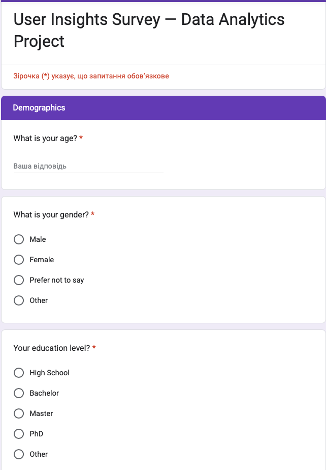

# 📊 Survey Data Analysis Project

This project focuses on analyzing survey data and visualizing categorical and numerical features. It demonstrates a full data analysis workflow — from cleaning to creating analytical plots.

---

## 📸 Google Form Used for Data Collection

Below is the form that was used to create the survey dataset:

---

## 🔍 Table of Contents
- Project Overview
- Project Structure
- Features
- Technologies Used
- How to Run
- Example Visualizations
- Author

---

## 📌 Project Overview

This is a training data analysis project based on a survey dataset (50 respondents). The project includes:

- loading and checking data  
- cleaning missing values  
- analyzing categorical variables  
- generating visual plots  
- saving results to outputs/figures

The project follows a standard Data Science folder structure.

---

## 📁 Project Structure

SurveyAnalysis/  
│  
├── data/                      – input CSV data  
│  
├── outputs/  
│   └── figures/               – saved plots  
│  
├── images/  
│   └── google_form.png        – screenshot of the Google Form  
│  
├── src/  
│   ├── data_cleaning.py       – data cleaning  
│   ├── analysis.py            – statistical analysis  
│   ├── visualization.py       – visualization functions  
│   └── main.py                – main analysis script  
│  
├── requirements.txt  
├── .gitignore  
└── README.md  

---

## ⚙️ Features

### ✔ Data Cleaning
- handling missing values  
- converting columns to correct data types  
- fixing inconsistent category names  

### ✔ Analysis
- frequency tables  
- descriptive statistics  
- comparisons by groups  

### ✔ Visualizations
- bar charts  
- histograms  
- pie charts  
- boxplots  

---

## 🛠 Technologies Used

- Python 3.13.5 
- Pandas  
- Matplotlib  
- Seaborn  
- PyCharm  
- Git & GitHub  

---

## 🚀 How to Run

1. Clone the repository  
git clone https://github.com/andreyvitalievich/SurveyAnalysis.git 

2. Move to the project folder  
cd SurveyAnalysis  

3. Install dependencies  
pip install -r requirements.txt  

4. Run the project  
python src/main.py  

All plots will be saved to:  
outputs/figures/

---

## 🖼 Example Visualizations

(age_histogram.png)  
(favorite_brand_pie.png)  
(satisfaction_by_country.png)  
(gender_barplot.png)  
(education_barplot.png)

---

## 👤 Author

Andrii Shyianovskyi  
Aspiring Data Analyst  
Email:  kabelua351@gmail.com  
LinkedIn: https://www.linkedin.com/in/андрій-шияновський-843663380/  
GitHub: https://github.com/andreyvitalievich 
